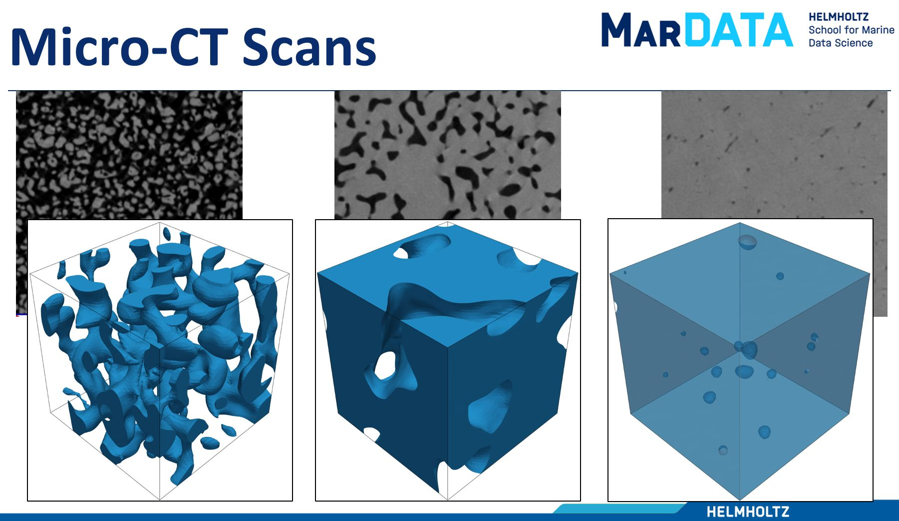

# 3D_SuperResolution_Segmentation

Searching for the best deep learning model for 3D super-resolution and segmentation of 3D micro CT images of Polar Ice Cores
We have two sets of data low-res and high-res scans of the specimens.
The order of the code: 

1- Manual Alignment to bring two sets as close as possible.

2- Use the SimpleITK image registration tool to create a set of data that is almost perfectly aligned.

3- Manual trimming for creating the input (low-res) and ground truth (high-res).

4- Developing different DL architectures.

5- Quantitative and qualitative analysis.

6- voxel-wise and microstructural metrics.

